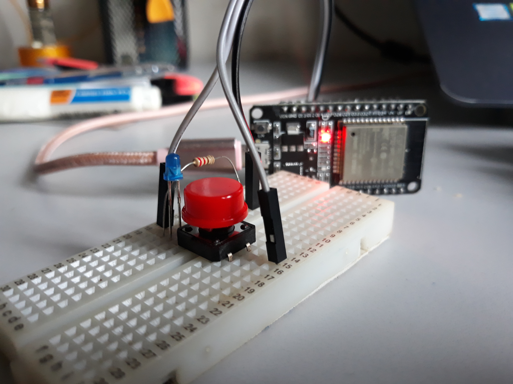

# Button ESP32 Telegram bot

## Prerequisite

- ESP32
- Push Button _(you can use any other input as well)_
- Telegram account
- Wifi or mobile hotspot.

## Steps

1. Connect pushbutton to pin **3V3**, **GND** and **D5**. _Power source will be from computer via USB._
2. Create your Telegram bot via [BotFather](https://t.me/botfather).
3. Copy the **token**.
4. Go to your bot and hit `/start`.
5. Now to get your chatId, got to [IDBot](https://telegram.me/myidbot). (You can also get chatId for a channel/group)
6. Send the command `/getid`. Copy the **reply**.
7. Now in `src/main.cpp`, replace
   - `*ssid` with your wifi **SSID name**.
   - `*password` with your wifi **password**.
   - `botToken` with **token** you copy from step 3.
   - `chatId` with **chatId** you get in step 5.
8. Upload to ESP32 and run.

## Images

